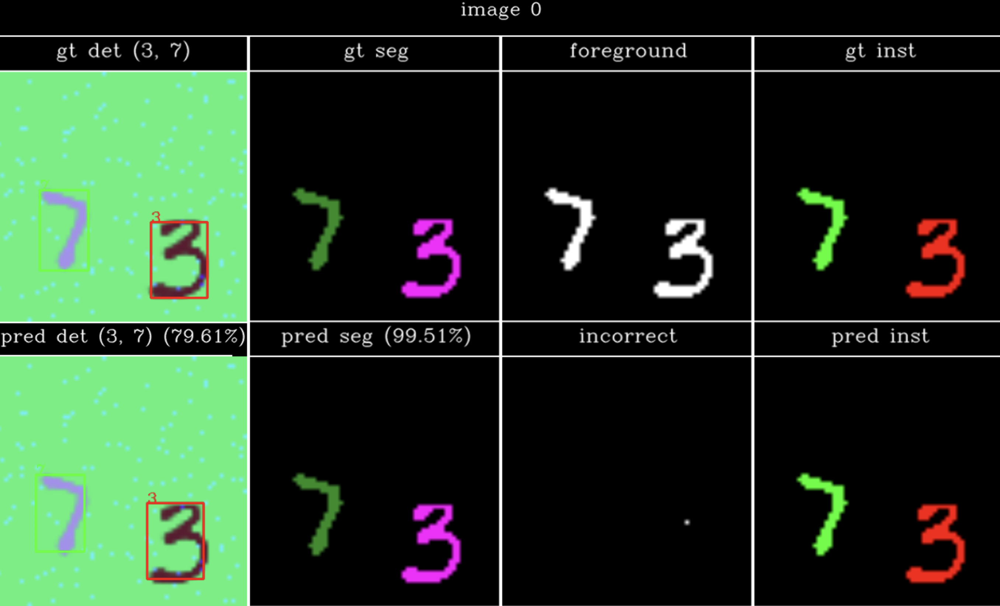
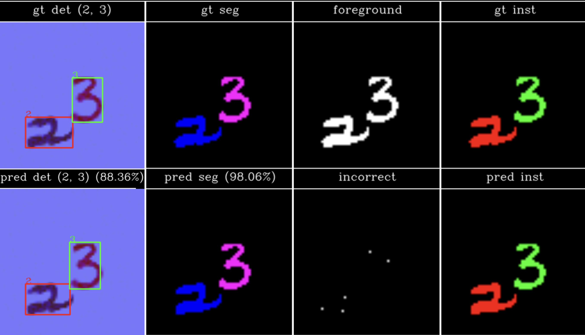
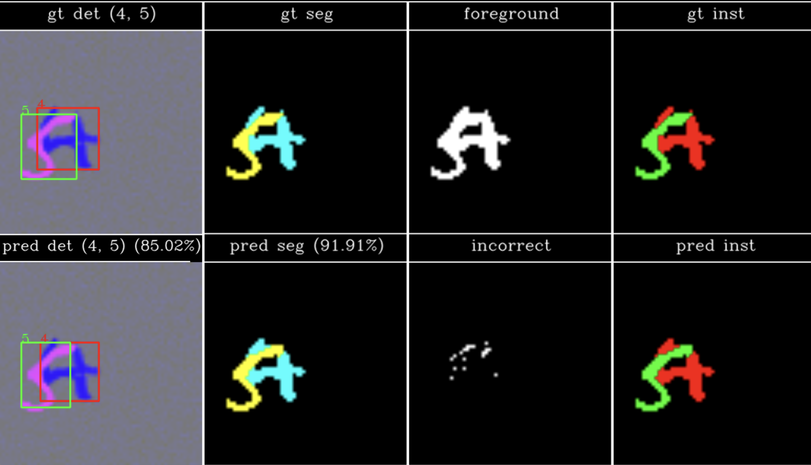

# MNISTDD-RGB: Object Detection and Semantic Segmentation  

This repository contains my implementation for **Assignment 4** of CMPUT 328 (Fall 2024). The objective of the assignment was to perform **object detection** and **semantic segmentation** on the MNIST Double Digits RGB (MNISTDD-RGB) dataset. The tasks involved identifying the digits in the images, determining their bounding boxes, and generating pixel-wise segmentation masks.  

---

## Overview  

The MNISTDD-RGB dataset consists of 64×64 RGB images containing two randomly placed MNIST-like digits with added noise.  
Key objectives:  
1. **Object Detection**: Detect the digits and their bounding boxes.  
2. **Semantic Segmentation**: Generate class-wise segmentation masks for the digits.  
3. **Instance Segmentation**: Generate instance-wise segmentation masks for the digits.  

---

## Implementation  

### Methodology  

- **Object Detection**:  
  - Used a pretrained **YOLOv11** model, fine-tuned for detecting two digits and their bounding boxes.  
- **Semantic Segmentation and Instance Segmentation**:  
  - Implemented a **UNet** architecture for generating pixel-wise class segmentation masks and to predict instance-wise masks for each digit.  
---

## Evaluation  

The performance is evaluated using the following metrics:  
1. **Classification Accuracy**: Percentage of correctly classified digits.  
2. **Detection Accuracy**: Mean Intersection over Union (IoU) of predicted and ground-truth bounding boxes.  
3. **Segmentation Accuracy**: Percentage of correctly classified foreground pixels in the segmentation masks.  

---

## Results
Classification Accuracy: 98.810 %
Detection IOU: 86.356 %
Segmentation Accuracy: 95.516 %
#### Result 1  
  
#### Result 2  
  
#### Result 3  
  
